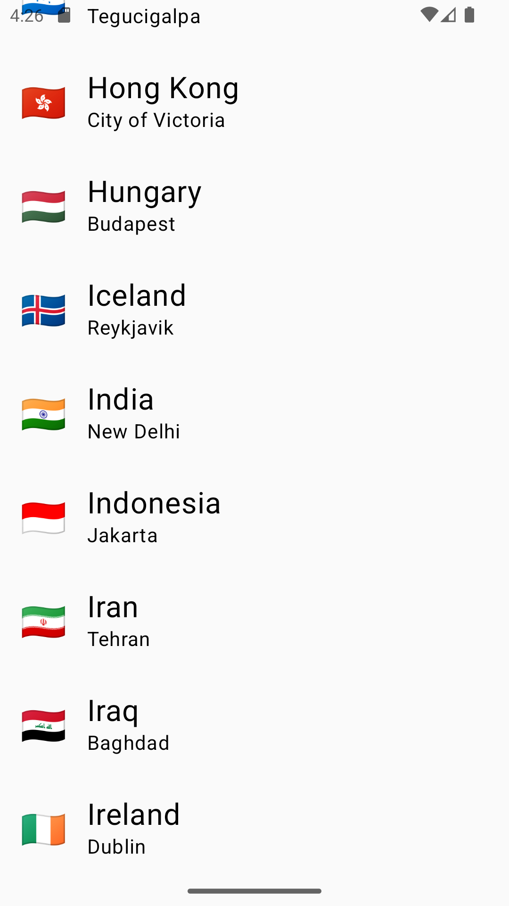
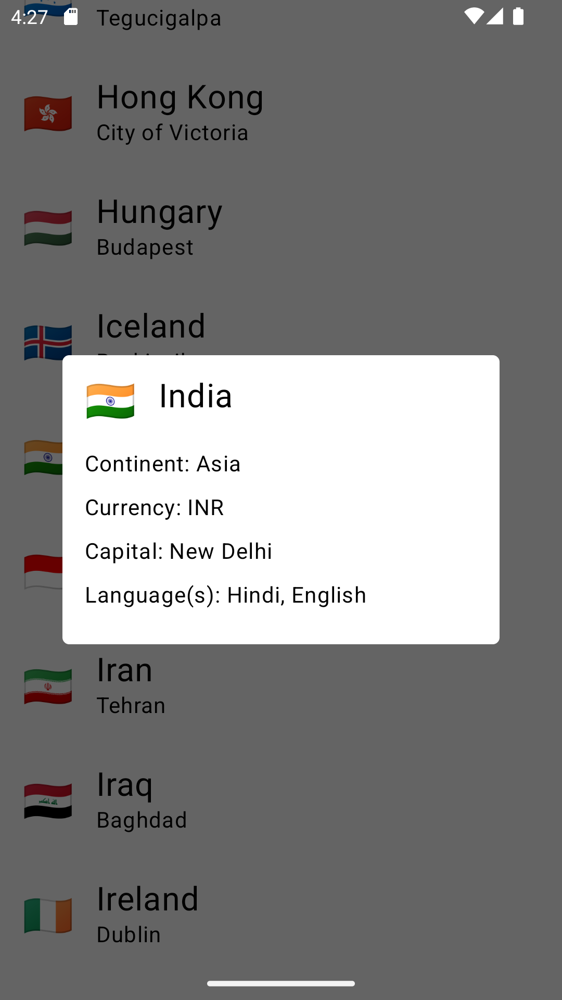

# GraphQL-Sample
GraphQL is a query language for the APIs for getting your data. It is an alternative for the REST APIs. 

## Graphql plugin:

👉 Installation
The plugin is available on the JetBrains plugin repository. To install it from the IDE, go to Settings | Plugins | Marketplace | search for "Apollo GraphQL" | Install
Please check the [plugin](https://plugins.jetbrains.com/plugin/20645-apollo-graphql) page for up to date information.

## Get to the countries API here:

👉 https://studio.apollographql.com/public/countries/variant/current/home

## Get the GraphQL schema file

Either, manually:
👉 [Apollo Studio Schema Reference](https://studio.apollographql.com/public/countries/variant/current/schema/reference)

Or using Apollo's gradle task:

```shell
./gradlew :app:downloadApolloSchema --endpoint='paste-apollo-url-here' --schema=app/src/main/graphql/schema.graphqls
```

Replace <paste-apollo-url-here> with the actual API schema URL you obtained from the Apollo Studio reference.

Example:
```shell
./gradlew :app:downloadApolloSchema --endpoint='https://countries.trevorblades.com/graphql' --schema=app/src/main/graphql/schema.graphqls
```

## 🖼️ OutPut Screens

| List Screen| Details Screen                                        | 
|------------|-------------------------------------------------------|
|  |  |


## Useful links

- [Apollo Kotlin README](https://www.apollographql.com/docs/kotlin)


